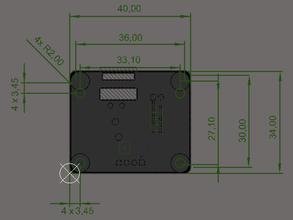
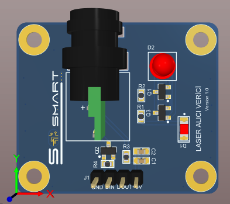
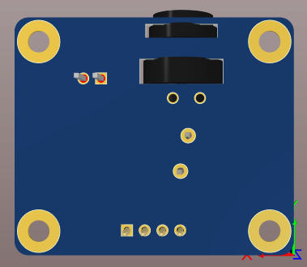
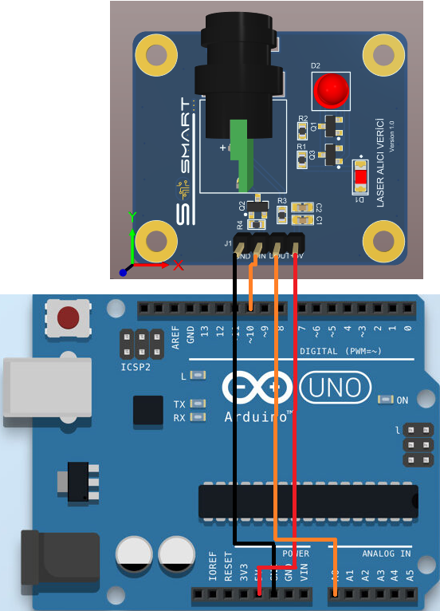
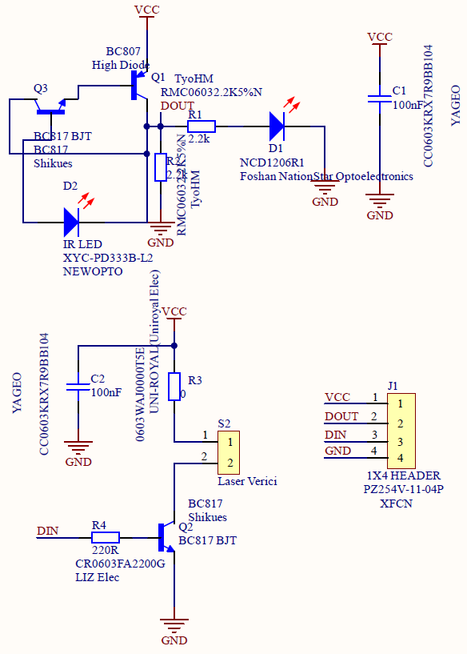

#  Lazer Alıcı-Verici Sensör Kartı

### 1. KAPSAM

Bu döküman Lazer Alıcı-Verici Sensör Kart'ının çalışma prensibini açıklar.

### 2. ÜRÜN PARAMETRELERİ

- 1 Çalışma Gerilimi: DC +5V 
- 2 Verici Dalga Boyu: 650nm
- 3 Verici Gücü: 5mW


### 3. MEKANİK





Pdf [Lazer-Sensor](Mechanic/Lazer-Sensor.pdf)

### 4. PİN AÇIKLAMALARI

|Pin Adı|Açıklama|
|------|------|
|GND|Toprak bağlantı pimi|
|DIN|Lazer dijital giriş pimi|
|DOUT|Verici dijital çıkış pimi|
|+5V|DC +5V besleme pimi|

### 5. Arduino Bağlantısı


### 6. Devre


Sch File [Lazer-Sensor](Circuit/Lazer-Sensor.pdf) 

Bom List [BomList](Circuit/Lazer-Sensor-BomList.pdf) 

Gerber File [Gerber](Circuit/Lazer-Sensor-Gerber.zip) 

### GENEL BAKIŞ
Lazer Alıcı-Verici Sensör Kartı  ürünü üstünde lazer ışığı(verici), ışık algılayıcı(alıcı) ve çeşitli kompanentler bulunan bir mesafe sensör modülüdür. Diğer mesafe sensörlerinden farklı olarak analog yerine dijital çıkış vermesi daha kolay kod yazma konusunda avantaj sağlar. Arduino kartıyla uyumludur.Prototiplemeye imkan sağlaması, arduino ve çeşitli devrelerde rahatça kullanılabilmesi için gerekli pinler devre kartı sayesinde dışarıya alınmıştır.Standart pin yapısı sayesinde rahatça kontrol edilebilir. Jumper kablolar ile bağlantıları yapılabilir.
 Genel Kullanım Alanları;
- Engel tespiti
- Boru hattı sayacı
- Akıllı robot
- Engelli araçları
### Arduino Örnek Kodu

```
int laser_din=A0;
int laser_i=10;
void setup()
{
  pinMode(laser_din,INPUT);
  pinMode(laser_i,OUTPUT);
  Serial.begin(9600);
}
void loop()
{
digitalWrite(laser_i,HIGH);
int sensorValue=analogRead(A0);
float voltage= sensorValue*(5.0/1023.0);

if (voltage>=1.5)
{
   Serial.println("Engel Yok");
  }
  else
  {
    Serial.println("Engel!");
  }
  delay(500);
}


``` 

[Laser_Sensor](ArduionoExample/Laser_Sensor/Laser_Sensor.ino)
